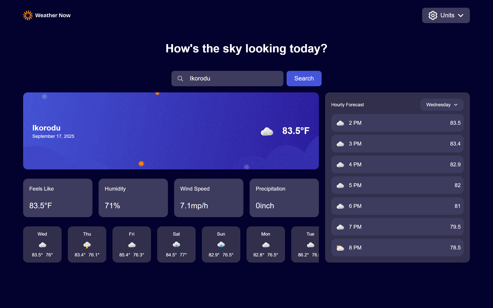

# Frontend Mentor - Weather app solution

This is a solution to the [Weather app challenge on Frontend Mentor](https://www.frontendmentor.io/challenges/weather-app-K1FhddVm49). Frontend Mentor challenges help you improve your coding skills by building realistic projects. 

## Table of contents

- [Overview](#overview)
  - [The challenge](#the-challenge)
  - [Screenshot](#screenshot)
  - [Links](#links)
- [My process](#my-process)
  - [Built with](#built-with)
  - [What I learned](#what-i-learned)
  - [Continued development](#continued-development)
  - [Useful resources](#useful-resources)
- [Author](#author)


## Overview

### The challenge

Users should be able to:

- Search for weather information by entering a location in the search bar
- View current weather conditions including temperature, weather icon, and location details
- See additional weather metrics like "feels like" temperature, humidity percentage, wind speed, and precipitation amounts
- Browse a 7-day weather forecast with daily high/low temperatures and weather icons
- View an hourly forecast showing temperature changes throughout the day
- Switch between different days of the week using the day selector in the hourly forecast section
- Toggle between Imperial and Metric measurement units via the units dropdown 
- Switch between specific temperature units (Celsius and Fahrenheit) and measurement units for wind speed (km/h and mph) and precipitation (millimeters) via the units dropdown
- View the optimal layout for the interface depending on their device's screen size
- See hover and focus states for all interactive elements on the page

### Screenshot




### Links

- Solution URL: [Solution url coming](https://your-solution-url.com)
- Live Site URL: [live site url coming](https://your-live-site-url.com)

## My process

### Built with

- Semantic HTML5 markup
- CSS custom properties
- Flexbox
- CSS Grid
- Mobile-first workflow
- [React](https://reactjs.org/) - JS library
- [Next.js](https://nextjs.org/) - React framework
- Tailwind


### What I learned
During this project, I learned: 
- How to set up and structure project using tailwind and Next.js
- Improved my understanding of concepts like state management and API call


```jsx
return(
        <>
            <Header  weatherData={weather} unit={unit} setUnit={setUnit}/>
            <InputField location={location} error={error} setLocation={setLocation} handleSubmit={handleSubmit}/>
            {error ? (
            <p className='text-center'>{error}</p>
            ) : weather ? (
                <Content location={location}  weatherData={weather} isLoading={loading} />
            ): null
            }
            
        
        
        </>
    )
```

### Continued development

In the future I plan to improve this project by: 
- Adding [new features](light-mode, notifications, authentication)
- Implementing [advanced feature](Typescript)
- Improving UI/UX design for a smoother user experience.
- Write texts to ensure project stability.

### Useful resources

- [Example resource 1](https://tailwindcss.com/docs) - This helped me for styling with tailwind. I really liked this pattern and will use it going forward.
- [Example resource 2](https://open-meteo.com/) - This is the free weather API i used it was super amazing


## Author

- Website - Loading...
- Frontend Mentor - [@Joseph-Oluwapelumi31](https://www.frontendmentor.io/profile/Joseph-Oluwapelumi31)
- Twitter -Loading...


